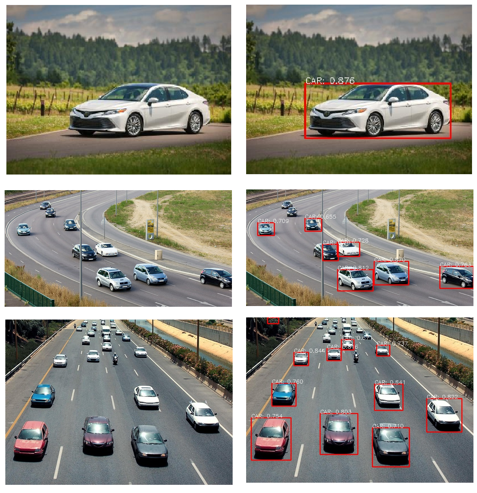
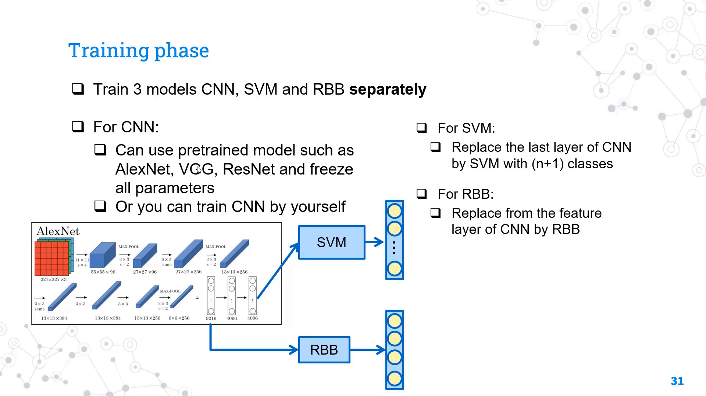

# RCNN for car

## Introduction

This is a machine learning project which leverage RCNN model to detect multiple objects in an image. Specifically, the model will receive an image and spot out cars on the image.

## Gallery

<p align="center">
    
</p>

## Model

The RCNN model follow the idea of these steps:

1. Searching for regions that may have objects (called region proposal)
2. Crop each region as a separate image
3. Feed those images to a CNN model

<p align="center">
    
</p>
<p align="center">
    <b>Model architecture</b>
</p>

For more detail, you can checkout ours explanation videos:

<p align="center">
    <a href="https://youtu.be/rPH7u8POKBQ">
        
    </a>
</p>

## Usage

Regardings the pre-trained model, we have splitted it into 10 parts in `models`. Please first use a joiner tool (example [pinetool](https://pinetools.com/join-files)) to join those file into `best_linear_svm_alexnet_car.pth`.

Then, you need to install all the requirement libraries:

```bash
pip install -r requirements.txt
```

Subsequently, using streamlit to host our website:

```bash
streamlit run streamlit_app.py
```

## Contribution

Our research team including:

- [phuc16102001](https://github.com/phuc16102001)
- [Qambitions](https://github.com/Qambitions)
- [vhbduy](https://github.com/vhbduy)
- [minhsile](https://github.com/minhsile)

## Citation

This repository is built based on [R-CNN repository](https://github.com/object-detection-algorithm/R-CNN) by [zhujian](https://github.com/zjykzj).

Reference papers:

```bibtex
@misc{girshick2013rich,
    title={Rich feature hierarchies for accurate object detection and semantic segmentation},
    author={Ross Girshick and Jeff Donahue and Trevor Darrell and Jitendra Malik},
    year={2013},
    eprint={1311.2524},
    archivePrefix={arXiv},
    primaryClass={cs.CV}
}

@misc{pascal-voc-2007,
	author = "Everingham, M. and Van~Gool, L. and Williams, C. K. I. and Winn, J. and Zisserman, A.",
	title = "The {PASCAL} {V}isual {O}bject {C}lasses {C}hallenge 2007 {(VOC2007)} {R}esults",
	howpublished = "http://www.pascal-network.org/challenges/VOC/voc2007/workshop/index.html"
}
```

## License

[MIT](LICENSE)
